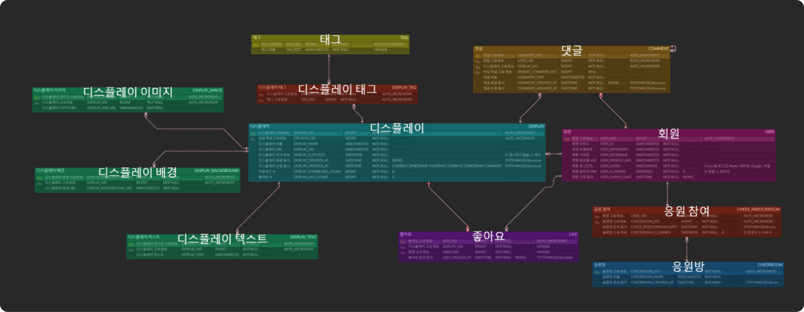

# 산출물

### [요구사항 명세서](https://www.notion.so/11fbac06e415810c8a7ee7ef5300ea7a?v=c775ea3c18a0493b868ba2b58eeda415)

1. 회원 관리
    - 로그인
    - 로그아웃
    - 회원가입
    - 회원탈퇴
    - 닉네임 수정
    - 프로필 사진 수정

2. 커스텀 디스플레이
    - 디스플레이 생성
    - 디스플레이 미리보기
    - 디스플레이 상세
    - 디스플레이 수정
    - 디스플레이 삭제

3. 디스플레이 게시판
    - 디스플레이 목록
    - 디스플레이 검색
    - 디스플레이 정보

4. 개인 응원
    - 디스플레이 제어

5. 단체 응원
    - 응원방 생성
    - 응원방 정보
    - 응원방 수정
    - 응원방 삭제
    - 응원 들어가기
    - 응원 나가기

6. AI 기능
    - 오디오 기반 실시간 컬러 매칭 생성
    - 매개변수 기반 디스플레이 제어

### [API 명세서](https://www.notion.so/API-11fbac06e4158105be83c18f00e40f1e)
- 진행중

### [ERD](https://www.erdcloud.com/d/4EnaWu3u29DjWuNTc)
- [문서](https://www.notion.so/ERD-11fbac06e41581eeb357e3e4574e5228)
